# TrendZone - AI Personal Shopper E-Commerce Platform

<div align="center">


**"Don't just build a shop. Build a Shopkeeper."**

*A next-generation e-commerce platform featuring an AI Personal Shopper that doesn't just chat—it acts.*

[Live Demo](#) · [Documentation](#architecture) · [Setup Guide](#installation)

</div>

---

## 📋 Table of Contents

- [Overview](#overview)
- [Key Features](#key-features)
- [Architecture](#architecture)
- [System Flow](#system-flow)
- [AI Implementation](#ai-implementation)
- [Database Design](#database-design)
- [Design Patterns](#design-patterns)
- [Tech Stack](#tech-stack)
- [Installation](#installation)
- [API Reference](#api-reference)
- [Innovation Highlights](#innovation-highlights)

---

## 🎯 Overview

TrendZone is a fully-featured e-commerce platform built for the **Softronix4.0 Web Development Hackathon**. It reimagines online shopping by introducing **"The Clerk"** — an AI-powered personal shopper that can:

- Understand natural language queries
- Search products semantically
- Control the website UI in real-time
- Negotiate discounts dynamically
- Complete purchases through conversation alone

### The Problem We Solve

Traditional e-commerce websites are:
- **Static** — Fixed images, no interaction
- **Impersonal** — No one to consult or guide
- **Mechanical** — Click-heavy, menu-driven navigation

### Our Solution

TrendZone transforms shopping into a **conversational experience**. Users can find, explore, and purchase products without clicking a single "Add to Cart" button — just by talking to The Clerk.

---

## ✨ Key Features

### 🛍️ A. The Storefront (The Body)

| Feature | Description |
|---------|-------------|
| **Product Catalog** | Full product listing with filtering, sorting, and categories |
| **Product Detail Pages** | Rich product information with images, sizes, colors, reviews |
| **Shopping Cart** | Persistent cart with real-time updates |
| **Checkout Flow** | Complete checkout with shipping and payment |
| **Admin Dashboard** | Product management, order tracking, coupon creation |

### 🤖 B. The RAG-Based Agent (The Clerk)

| Capability | Implementation |
|------------|----------------|
| **Semantic Search** | Understands context: "summer wedding outfit" → shows linens, sunglasses |
| **Inventory Check** | Real-time stock verification from database |
| **Rich Results** | Product cards with images, prices, reviews, and direct links |
| **No-Menu Rule** | Complete purchase flow through conversation only |

### ⚡ C. The Vibe Filter (Real-Time UI Control)

```
User: "Show me cheaper options"
↓
The Clerk triggers filterAction()
↓
Shop page instantly sorts by price: Low → High
↓
Toast notification confirms the change
```

The AI doesn't just respond—it **controls the website UI in real-time**.

### 💰 D. Haggle Mode (Dynamic Negotiation)

```
User: "It's my birthday! Can I get a discount?"
↓
AI analyzes sentiment and reason
↓
Generates unique coupon: BDAY-15XYZW
↓
Coupon is stored in database
↓
User can apply directly from chat
```

**Discount Logic:**
- Birthday → 15% off
- Wedding → 20% off
- First-time customer → 10% off
- Bulk purchase → 12% off
- Rude behavior → Polite decline (no discount)

---

## 🏗️ Architecture

### High-Level System Architecture

```
┌─────────────────────────────────────────────────────────────────────┐
│                         CLIENT (React SPA)                          │
├─────────────────────────────────────────────────────────────────────┤
│  ┌──────────────┐  ┌──────────────┐  ┌──────────────┐              │
│  │   Pages      │  │  Components  │  │   Contexts   │              │
│  │  - Index     │  │  - ClerkChat │  │  - Cart      │              │
│  │  - Shop      │  │  - Navbar    │  │  - Filter    │              │
│  │  - Product   │  │  - Footer    │  │  - Auth      │              │
│  │  - Cart      │  │  - ProductGrid│ │              │              │
│  │  - Checkout  │  │              │  │              │              │
│  └──────────────┘  └──────────────┘  └──────────────┘              │
├─────────────────────────────────────────────────────────────────────┤
│                         AI LAYER                                    │
│  ┌──────────────────────────────────────────────────────────────┐  │
│  │                    ClerkAgent (clerk-agent.ts)                │  │
│  │  ┌─────────────┐  ┌─────────────┐  ┌─────────────┐          │  │
│  │  │ Intent      │  │ RAG Search  │  │ Haggle      │          │  │
│  │  │ Analysis    │  │ (rag.ts)    │  │ Engine      │          │  │
│  │  └─────────────┘  └─────────────┘  └─────────────┘          │  │
│  │         ↓                ↓                ↓                   │  │
│  │  ┌─────────────────────────────────────────────────────┐     │  │
│  │  │           Gemini AI (gemini-client.ts)              │     │  │
│  │  │           Model: gemini-2.5-flash                   │     │  │
│  │  └─────────────────────────────────────────────────────┘     │  │
│  └──────────────────────────────────────────────────────────────┘  │
├─────────────────────────────────────────────────────────────────────┤
│                         DATA LAYER                                  │
│  ┌──────────────────────────────────────────────────────────────┐  │
│  │                    Supabase (PostgreSQL)                      │  │
│  │  ┌─────────┐ ┌─────────┐ ┌─────────┐ ┌─────────────────────┐ │  │
│  │  │products │ │cart_items│ │ orders  │ │ product_embeddings  │ │  │
│  │  └─────────┘ └─────────┘ └─────────┘ └─────────────────────┘ │  │
│  │  ┌─────────┐ ┌─────────┐ ┌─────────────────────────────────┐ │  │
│  │  │ coupons │ │user_activity│ │   pgvector (RAG/Semantic)   │ │  │
│  │  └─────────┘ └─────────┘ └─────────────────────────────────┘ │  │
│  └──────────────────────────────────────────────────────────────┘  │
└─────────────────────────────────────────────────────────────────────┘
```

### Component Architecture

```
App.tsx
├── Providers
│   ├── QueryClientProvider (React Query)
│   ├── UserAuthProvider (Supabase Auth)
│   ├── AuthProvider (Admin Auth)
│   ├── FilterProvider (Shop Filters)
│   └── CartProvider (Shopping Cart)
├── Routes
│   ├── / (Index - Homepage)
│   ├── /shop (Product Listing)
│   ├── /product/:id (Product Detail)
│   ├── /cart (Shopping Cart)
│   ├── /checkout (Checkout Flow)
│   ├── /signin (User Auth)
│   └── /admin/* (Admin Dashboard)
└── ClerkChat (AI Personal Shopper - Global)
```

---

## 🔄 System Flow

### 1. User Chat Flow


### 2. Add to Cart Flow (Voice-First)

```mermaid
sequenceDiagram
    participant User
    participant ClerkAgent
    participant CartContext
    participant Supabase

    User->>ClerkAgent: "Add the linen blazer to my cart"
    ClerkAgent->>ClerkAgent: analyzeIntent() → "add_to_cart"
    ClerkAgent->>ClerkAgent: matchProduct("linen blazer")
    ClerkAgent->>ClerkAgent: Check sizes available
    ClerkAgent-->>User: "Which size? Available: S, M, L, XL"
    User->>ClerkAgent: "Medium"
    ClerkAgent->>ClerkAgent: handleSizeResponse("M")
    ClerkAgent->>CartContext: addItem(product, "M", 1)
    CartContext->>Supabase: INSERT INTO cart_items
    ClerkAgent-->>User: "Added Linen Blazer (M) to cart! 🛒"
```



### 3. Haggle/Discount Flow

```mermaid
sequenceDiagram
    participant User
    participant ClerkAgent
    participant Haggle Engine
    participant Gemini AI
    participant Supabase

    User->>ClerkAgent: "It's my birthday! Any discount?"
    ClerkAgent->>ClerkAgent: analyzeIntent() → "haggle"
    ClerkAgent->>Haggle Engine: processHaggle(message)
    Haggle Engine->>Haggle Engine: analyzeHaggleRequest()
    Haggle Engine->>Haggle Engine: Detect "birthday" → 15% eligible
    Haggle Engine->>Haggle Engine: generateCouponCode("birthday", 15)
    Haggle Engine->>Supabase: INSERT INTO coupons (BDAY-15XYZW)
    Haggle Engine-->>ClerkAgent: HaggleResult{success, couponCode}
    ClerkAgent-->>User: "Happy Birthday! 🎉 Use code BDAY-15XYZW"
```



### 4. Vibe Filter Flow (UI Control)

```mermaid
sequenceDiagram
    participant User
    participant ClerkAgent
    participant ClerkChat
    participant FilterContext
    participant Shop Page

    User->>ClerkAgent: "Show me cheaper options"
    ClerkAgent->>ClerkAgent: analyzeIntent() → "filter"
    ClerkAgent->>ClerkAgent: handleFilter("sort_by_price", "asc")
    ClerkAgent-->>ClerkChat: action: {type: "filter", payload: {...}}
    ClerkChat->>FilterContext: setSort("price", "asc")
    FilterContext->>Shop Page: Trigger re-render
    Shop Page->>Shop Page: Products sorted low→high
    ClerkChat->>ClerkChat: navigate("/shop")
    ClerkChat-->>User: "🔄 Sorted by price! Check the shop!"
```



---

## 🧠 AI Implementation

### Is The AI Proper or Hardcoded?

**✅ PROPER AI IMPLEMENTATION** — Not hardcoded.

Here's the evidence:

#### 1. Intent Analysis (Dynamic)

```typescript
// src/lib/ai/clerk-agent.ts
private async analyzeIntent(message: string): Promise<any> {
  // Uses pattern matching + context-awareness
  // Maintains conversation context for referential understanding
  // "the first one", "that one" → uses lastShownProducts
}
```

The intent analysis is **context-aware** and uses:
- Pattern matching for known intents
- Conversation history for references
- Product context for disambiguation

#### 2. Semantic Search (RAG-Based)

```typescript
// src/lib/ai/rag.ts
export async function advancedSearch(query: string, limit: number): Promise<SearchResult> {
  // 1. Spell correction with Levenshtein distance
  const correctedQuery = correctSpelling(query);
  
  // 2. Color extraction
  const extractedColor = extractColor(correctedQuery);
  
  // 3. Database search with intelligent matching
  const results = await searchSupabaseProducts(correctedQuery, extractedColor, limit);
  
  // 4. Category-based fallback
  // 5. Returns structured SearchResult with metadata
}
```

Features:
- **Spell Correction**: "sneeker" → "sneaker" (using Levenshtein distance)
- **Color Filtering**: "blue sneakers" → extracts "blue" as filter
- **Keyword Extraction**: Identifies product types from natural language
- **Database Integration**: Queries Supabase with OR conditions

#### 3. Haggle Engine (AI-Powered)

```typescript
// src/lib/ai/haggle.ts
export async function analyzeHaggleRequest(userMessage: string): Promise<{
  eligible: boolean;
  discountPercent: number;
  reason: string;
  sentiment: "positive" | "neutral" | "negative";
}> {
  // FAST PATH: Known patterns (birthday, wedding, bulk)
  if (hasBirthday) return { eligible: true, discountPercent: 15, ... };
  
  // SLOW PATH: Gemini AI for complex requests
  const model = getGeminiModel("gemini-2.5-flash");
  const result = await model.generateContent(prompt);
  // Parse JSON response from AI
}
```

**Hybrid Approach:**
- **Fast Path**: Known patterns (birthday, wedding) → instant response
- **AI Path**: Complex/ambiguous requests → Gemini analysis
- **Sentiment Analysis**: Rude users get declined

#### 4. Gemini AI Integration

```typescript
// src/lib/ai/gemini-client.ts
import { GoogleGenerativeAI } from "@google/generative-ai";

export const getGeminiModel = (modelName: string = "gemini-2.5-flash") => {
  const genAI = new GoogleGenerativeAI(apiKey);
  return genAI.getGenerativeModel({ model: modelName });
};
```

Uses **Gemini 2.5 Flash** for:
- Haggle request analysis
- Sentiment detection
- Complex intent understanding

### AI Capabilities Matrix

| Feature | Implementation | AI Model Used |
|---------|---------------|---------------|
| Intent Detection | Pattern Matching + Context | None (Rule-based) |
| Semantic Search | RAG + Spell Correction | None (Algorithms) |
| Haggle Analysis | Keyword Detection + AI | Gemini 2.5 Flash |
| Sentiment Detection | AI-Powered | Gemini 2.5 Flash |
| Product Matching | Fuzzy Matching + Context | None (Algorithms) |
| UI Control | Action Dispatch | None (Events) |

---

## 🗃️ Database Design

### Entity-Relationship Diagram

```
┌─────────────────┐       ┌─────────────────┐
│    products     │       │   cart_items    │
├─────────────────┤       ├─────────────────┤
│ id (PK)         │───────│ product_id (FK) │
│ name            │       │ session_id      │
│ description     │       │ user_id (FK)    │
│ price           │       │ size            │
│ image_url       │       │ quantity        │
│ category        │       └─────────────────┘
│ sizes (JSONB)   │
│ colors (JSONB)  │       ┌─────────────────┐
│ stock           │       │     orders      │
│ tags (JSONB)    │       ├─────────────────┤
│ metadata (JSONB)│       │ id (PK)         │
└─────────────────┘       │ user_id (FK)    │
        │                 │ session_id      │
        │                 │ total           │
        ▼                 │ status          │
┌─────────────────┐       │ shipping_address│
│product_embeddings│      │ coupon_code     │
├─────────────────┤       └─────────────────┘
│ id (PK)         │               │
│ product_id (FK) │               ▼
│ embedding (768) │       ┌─────────────────┐
│ text_content    │       │   order_items   │
└─────────────────┘       ├─────────────────┤
                          │ order_id (FK)   │
┌─────────────────┐       │ product_id (FK) │
│    coupons      │       │ size            │
├─────────────────┤       │ quantity        │
│ id (PK)         │       │ price           │
│ code (UNIQUE)   │       └─────────────────┘
│ discount_type   │
│ discount_value  │       ┌─────────────────┐
│ valid_from      │       │  user_activity  │
│ valid_until     │       ├─────────────────┤
│ usage_limit     │       │ session_id      │
│ used_count      │       │ user_id (FK)    │
│ created_by_agent│       │ activity_type   │
│ reason          │       │ product_id (FK) │
└─────────────────┘       │ metadata (JSONB)│
                          └─────────────────┘
```

### Key Tables

| Table | Purpose |
|-------|---------|
| `products` | Product catalog with JSONB arrays for sizes/colors/tags |
| `cart_items` | Shopping cart (supports guest + authenticated users) |
| `orders` | Order history with status tracking |
| `order_items` | Line items for each order |
| `coupons` | Discount codes (includes AI-generated ones) |
| `user_activity` | Tracking for recommendation engine |
| `product_embeddings` | Vector embeddings for semantic search (pgvector) |

### Indexing Strategy

```sql
-- Performance indexes
CREATE INDEX products_category_idx ON products (category);
CREATE INDEX products_price_idx ON products (price);
CREATE INDEX products_tags_gin_idx ON products USING gin (tags);

-- Vector similarity search
CREATE INDEX product_embeddings_vector_idx 
ON product_embeddings USING ivfflat (embedding vector_cosine_ops)
WITH (lists = 100);
```

---

## 🎨 Design Patterns

### 1. Provider Pattern (Context API)

```typescript
// Centralized state management
<UserAuthProvider>      {/* User authentication */}
  <AuthProvider>        {/* Admin authentication */}
    <FilterProvider>    {/* Shop filters */}
      <CartProvider>    {/* Shopping cart */}
        {children}
      </CartProvider>
    </FilterProvider>
  </AuthProvider>
</UserAuthProvider>
```

**Benefits:**
- Single source of truth
- No prop drilling
- Easy state sharing across components

### 2. Agent Pattern (AI)

```typescript
class ClerkAgent {
  private conversationHistory: ClerkMessage[] = [];
  private context: ConversationContext = {...};
  
  async chat(message: string, sessionId: string): Promise<ClerkResponse> {
    const intent = await this.analyzeIntent(message);
    // Route to appropriate handler
    switch(intent.type) {
      case "search": return this.handleSearch(...);
      case "add_to_cart": return this.handleAddToCart(...);
      case "haggle": return this.handleHaggle(...);
    }
  }
}
```

**Benefits:**
- Encapsulated AI logic
- Maintains conversation state
- Extensible for new capabilities

### 3. Repository Pattern (Data Access)

```typescript
// src/lib/api/products.ts
export async function getProducts(filters?, sort?): Promise<Product[]> {
  if (supabase) {
    // Try Supabase first
    const { data, error } = await supabase.from("products").select("*");
    if (data) return data;
  }
  // Fallback to local products
  return localProducts;
}
```

**Benefits:**
- Abstracted data source
- Graceful fallbacks
- Easy to swap backends

### 4. Strategy Pattern (Filtering)

```typescript
// FilterContext.tsx
const applyFilter = (filterType: string, value: any) => {
  switch (filterType) {
    case "sort_by_price": setSort("price", value);
    case "filter_by_category": setCategory(value);
    case "search": setSearchQuery(value);
  }
};
```

**Benefits:**
- Extensible filter types
- Decoupled from UI
- AI can trigger any filter

### 5. Observer Pattern (Real-Time UI)

```typescript
// ClerkChat.tsx
const handleAction = async (action: any) => {
  if (action.type === "filter") {
    // Dispatch to FilterContext
    applyFilter(action.payload.filterType, action.payload.value);
    // Navigate to see changes
    navigate("/shop");
  }
};
```

**Benefits:**
- AI actions update UI
- Loose coupling
- Multiple subscribers possible

---

## 🛠️ Tech Stack

### Frontend

| Technology | Version | Purpose |
|------------|---------|---------|
| React | 18.3 | UI Framework |
| TypeScript | 5.8 | Type Safety |
| Vite | 5.4 | Build Tool |
| TailwindCSS | 3.4 | Styling |
| shadcn/ui | Latest | Component Library |
| React Router | 6.30 | Navigation |
| TanStack Query | 5.83 | Data Fetching |
| Framer Motion | 12.34 | Animations |

### Backend

| Technology | Version | Purpose |
|------------|---------|---------|
| Supabase | 2.95 | Database + Auth |
| PostgreSQL | 15 | Database Engine |
| pgvector | Latest | Vector Search |
| Gemini AI | 2.5 Flash | AI Processing |

### Development

| Tool | Purpose |
|------|---------|
| ESLint | Code Linting |
| Vitest | Testing |
| PostCSS | CSS Processing |

---

## 📦 Installation

### Prerequisites

- Node.js 18+
- npm/yarn/pnpm
- Supabase account
- Google AI (Gemini) API key

### Setup

1. **Clone the repository**
   ```bash
   git clone https://github.com/yourusername/trendzone-bold-canvas.git
   cd trendzone-bold-canvas
   ```

2. **Install dependencies**
   ```bash
   npm install
   ```

3. **Configure environment**
   ```bash
   cp .env.example .env
   ```
   
   Fill in your `.env`:
   ```env
   VITE_SUPABASE_URL=https://your-project.supabase.co
   VITE_SUPABASE_ANON_KEY=your-anon-key
   VITE_GEMINI_API_KEY=your-gemini-api-key
   ```

4. **Setup Supabase database**
   - Go to Supabase SQL Editor
   - Run `supabase/schema.sql`
   - Run `supabase/seed-products.sql`

5. **Start development server**
   ```bash
npm run dev
```

6. **Open in browser**
   ```
   http://localhost:5173
   ```

---

## 📚 API Reference

### ClerkAgent API

```typescript
class ClerkAgent {
  // Main chat interface
  chat(message: string, sessionId: string): Promise<ClerkResponse>
  
  // Clear conversation
  clearHistory(): void
  
  // Get current context
  getContext(): ConversationContext
}

interface ClerkResponse {
  message: string;           // AI response text
  products?: Product[];      // Product recommendations
  action?: ClerkAction;      // UI action to perform
}

interface ClerkAction {
  type: "filter" | "sort" | "add_to_cart" | "navigate";
  payload?: any;
}
```

### Products API

```typescript
// Get products with filters
getProducts(filters?: ProductFilters, sort?: ProductSort): Promise<Product[]>

// Semantic search
searchProductsSemantic(query: string, limit?: number): Promise<Product[]>

// Get recommendations
getRecommendedProducts(sessionId: string, limit?: number): Promise<Product[]>
```

### Haggle API

```typescript
// Process discount request
processHaggle(message: string, sessionId: string): Promise<HaggleResult>

interface HaggleResult {
  success: boolean;
  couponCode?: string;
  discount: number;
  message: string;
}
```

---

## 💡 Innovation Highlights

### 1. Voice-First Commerce
Users can complete entire shopping journeys through conversation—no clicking required.

### 2. Real-Time UI Control
The AI doesn't just respond—it **controls the website**. "Show me cheaper options" instantly sorts the shop page.

### 3. Dynamic Negotiation
AI-powered haggling with sentiment analysis. Be nice, get discounts. Be rude, get declined.

### 4. Contextual Understanding
The Clerk remembers context: "Add the first one to cart" works because it tracks shown products.

### 5. Graceful Degradation
Works without Supabase (local fallback), without Gemini (rule-based fallback), and without JavaScript (static product pages).

### 6. Hybrid AI Approach
Combines rule-based speed with AI flexibility—instant responses for common queries, AI for complex ones.

---

## 👥 Team

Built for **Softronix4.0 Web Development Hackathon**

---

## 📄 License

MIT License - feel free to use and modify for your own projects.

---

<div align="center">

**Built with ❤️ for the future of e-commerce**

*"Don't just build a shop. Build a Shopkeeper."*

</div>
# ecommerce_web_hackathon
